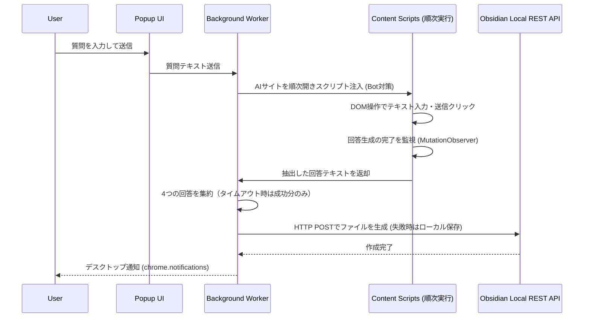

# Chrome拡張機能の開発計画

## 1. 全体設計と構成

- **Manifest V3** に準拠したChrome拡張を作成します。
- **ポップアップ画面**からプロンプトを入力し、送信を実行します。
- **Background Worker**がChatGPT, Claude, Gemini, Grokの4タブを**順次（キュー処理で）**自動で開き、各サービスの画面に合わせた **Content Script** を注入します。
  - *※Bot対策・自動化検知を避けるため、同時送信ではなく順次送信とします。*
- 各Content Scriptがテキストエリアへの入力、送信、回答の完了監視、テキスト抽出を行います。
- 抽出した回答は、Background Workerから **Obsidian Local REST API** へHTTPリクエストを投げて、自動的にMarkdownファイルとしてローカルディレクトリに作成されます。
- **エラーハンドリング**: Obsidian未起動時や通信エラー時は `chrome.storage.local` に一時保存し、後で再送できるフェールセーフを設けます。
- **通知**: 処理完了時やエラー発生時は `chrome.notifications` API を用いてデスクトップ通知を行います。

## 2. 処理フロー




## 3. 実装上の重要戦略（レビュー反映）

### 3.1 DOM操作の脆弱性対策（最重要）

- 各AIサービスのUI変更でセレクタが壊れるリスクを軽減するため、**DOM要素のセレクタはハードコードせず、`options` 画面で設定可能**にします。
- `textarea[data-id]` のような安定しやすい属性ベースのセレクタを優先し、複数候補のフォールバックを用意します。

### 3.2 回答完了検知の戦略

- ストリーミングレスポンスの完了判定には `MutationObserver` を使用します。
- 「生成停止（Stop generating）」ボタンの消滅、「再生成（Regenerate）」や「コピー」ボタンの出現、または**一定時間（例: 3秒）DOMに変更がないこと**を完了のトリガーとします。
- *※完了検知が極めて不安定な場合は、ユーザーが「保存」ボタンを押した時点で回収する（手動回収）折衷案もオプションとして用意します。*

### 3.3 保存フォーマットとフォルダ構成

- 元の要件である「ベストな回答を作る」については、API費用や複雑化を避けるため、**全回答を並べたまとめファイル（Summary.md）を自動生成し、ユーザーが自分で判断する**スコープとします。
- **フォルダ構成例**:

```text
  AI-Research/
  └── YYYY-MM-DD_質問の先頭20文字/
      ├── question.md         # 元の質問
      ├── ChatGPT.md
      ├── Claude.md
      ├── Gemini.md
      ├── Grok.md
      └── Summary.md          # 全回答をまとめたファイル
  

```

## 4. 実装ステップ

- **Step 1: Obsidianプラグインの準備（ユーザー側作業）**
  - Obsidianにて「Local REST API」プラグインをインストール・有効化します。
  - APIキー（Bearer トークン）とポート番号を取得します。
- **Step 2: 拡張機能のベース作成**
  - `manifest.json` とポップアップ画面 (`popup.html` / `popup.js` / `popup.css`) を作成します。
  - APIキー、保存先パス、**DOMセレクタ**を設定する設定画面 (`options.html` / `options.js` / `options.css`) を作成します。
- **Step 3: Background Worker の実装**
  - 各AIサービスのURLを**順次開くキュー処理**と、開いたタブに対して Content Script を注入する処理を実装します。
- **Step 4: 各サービスの Content Script の実装**
  - 各AI（ChatGPT, Claude, Gemini, Grok）の現在のDOM構造を解析し、入力、送信、監視の処理を個別に実装します。
- **Step 5: Obsidian連携とエラーハンドリング**
  - Background Worker で回答を集約後、Obsidian API へリクエストを送り、ファイルを保存します。
  - 失敗時のローカル一時保存（フェールセーフ）と、完了時のデスクトップ通知を実装します。

## 5. ディレクトリ構成

```text
ai-prompt-broadcaster/
├── manifest.json
├── popup.html, popup.js, popup.css        # 質問の入力画面
├── options.html, options.js, options.css  # APIキー・パス・セレクタの設定画面
├── background.js                          # タブ管理(キュー)・通信ハブ・API送信・通知
├── content-chatgpt.js                     # ChatGPT用 操作スクリプト
├── content-claude.js                      # Claude用 操作スクリプト
├── content-gemini.js                      # Gemini用 操作スクリプト
└── content-grok.js                        # Grok用 操作スクリプト
```

