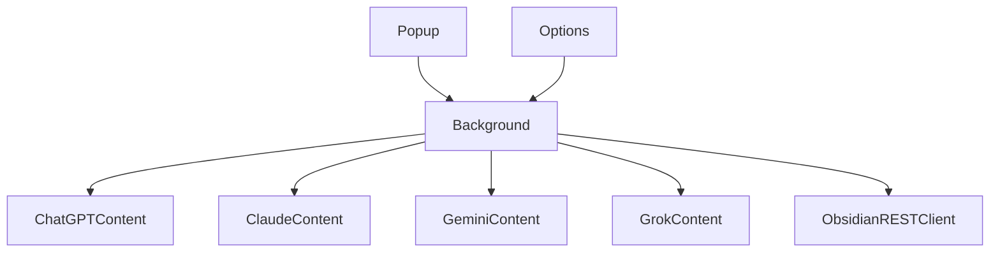

## MirrorChat Chrome拡張 実装プラン

### 背景と前提

- 既存ブランチ（例: `cursor/chrome-ai-obsidian-2808`）で、`manifest.json`・`popup`・`options`・`background.js`・各種 `content-*.js` を用いた拡張機能の土台が実装済みとみなす。
- Pull/2, Pull/3 では、`prompt-queue-extension`・`ai-chat-downloader`・`obsidian-local-rest-api` などのOSSから、**タブキュー処理・DOM完了検知・Markdown抽出・Obsidian連携**のベストプラクティスが整理されている。
- これらを**丸ごと乗り換えるのではなく、Pull/1 のアーキテクチャに「知見として注入する」形でリファクタリングする。**

### フェーズ1: ブランチと環境の整理

- **開発ブランチの準備**: main を最新化し、Pull/1 相当のブランチ（`cursor/chrome-ai-obsidian-2808` など）から作業用ブランチを作成する。
- **ドキュメント統合**: Pull/2, Pull/3 で作成したOSSリサーチドキュメント（例: `docs/GITHUB_OSS_RESEARCH.md`）を main 側に取り込み、常に参照できるようにする。
- **Obsidian 側の前提確認**: Local REST API プラグインが有効化され、トークン・ポート番号・Vaultパスが取得済みであることを確認する。

### フェーズ2: Optionsと設定スキーマの確立

- **設定項目の整理**: `options.html`/`options.js` で保持する設定として、以下を明文化し、型・キー名を固定する。
  - Obsidian のベースURL・トークン・保存ルートパス（例: `AI-Research/`）。
  - 各AIごとの DOM セレクタ群（入力欄・送信ボタン・回答コンテナ・完了判定用要素）。
- **セレクタの柔軟化**: Pull/3 の方針どおり、**セレクタはハードコードではなく Options から読み込む**構造を保ちつつ、初期値としてOSSリサーチから得た安定しやすいセレクタを埋め込む。
- **共通ストレージ層**: `chrome.storage.sync`/`local` への読み書きを行う小さなユーティリティを追加し、Popup・Background・Content Scripts から一貫したAPIで設定取得できるようにする。

### フェーズ3: Backgroundのタブキュー処理とObsidian連携の強化

- **タブキュー処理の整理**: Pull/3で推奨されている `prompt-queue-extension` の設計を参考に、`background.js` のロジックを次のように整理する。
  - 送信要求をキューに積み、**常に1つのタブだけをアクティブに処理**するループ（または再帰）を実装。
  - 各タスクの状態（待機中・実行中・完了・タイムアウト）を管理する小さなステートマシンを導入。
- **Content Script とのメッセージング統一**: 各 `content-*.js` と `background.js` 間のメッセージフォーマット（開始コマンド・進捗・完了・エラー）を定義し、どのAIでも同じ形のペイロードでやり取りできるようにする。
- **Obsidianクライアントの切り出し**: `background.js` 内に散らばっているHTTP呼び出しを `obsidianClient` 的なモジュール/関数群に集約し、以下を1か所で扱う。
  - ノート作成APIのURL組み立て。
  - 認証ヘッダ（Bearer トークン）の付与。
  - HTTPエラー時のリトライポリシーや例外整形。

### フェーズ4: 各AI向け Content Script の強化

- **共通方針**
  - Pull/2, Pull/3 で参照している `ai-chat-downloader` 等にならい、**DOM からのテキスト抽出 → Markdown 変換 → Background へ送信**の流れを統一する。
  - 回答コンテナの HTML を走査し、コードブロック・箇条書き・引用などをある程度きれいなMarkdownに落とすユーティリティを共通化する。
  - 完了検知には `MutationObserver` + タイムアウト + ボタン状態（Stop/Regenerateなど）の3本立てで実装する。
- **ChatGPT (`content-chatgpt.js`)**
  - OSSで確認した安定したセレクタ（入力欄・送信ボタン・回答コンテナ）を初期値として Options に設定。
  - `MutationObserver` で回答コンテナの変化を監視し、一定時間変化がなければ完了と判断。
  - 抽出したHTMLをMarkdownに変換する処理を導入し、Backgroundへ送信。
- **Claude (`content-claude.js`)**
  - Claude専用の回答要素（例: messageバブルのクラス）に対応した抽出ロジックを実装。
  - 長文・コードブロックへの対応を意識したMarkdown変換を入れる。
- **Gemini (`content-gemini.js`)**
  - 現行UIのDOM構造を前提に、入力送信と回答エリアのセレクタを Options に定義し、完了検知を実装。
- **Grok (`content-grok.js`)**
  - OSSの参考実装が少ない前提で、まずは**シンプルなDOMセレクタ＋タイムアウトベース**でMVPを作り、その後実際のUIを見ながらセレクタをチューニングする。

### フェーズ5: Obsidian保存・フォルダ構成・エラーハンドリング

- **フォルダ構成の実装**: 既存プランどおり、`AI-Research/YYYY-MM-DD_質問の先頭20文字/` 以下に `question.md`, `ChatGPT.md`, `Claude.md`, `Gemini.md`, `Grok.md`, `Summary.md` を生成するロジックを `background.js` に実装/整理する。
- **Summary生成**: 4つの回答テキストを集約し、シンプルなヘッダ付きMarkdown（各AI名ごとにセクション）で `Summary.md` を作成する。
- **フェールセーフ**: Obsidian API 呼び出しが失敗した場合に、リクエスト内容と回答テキストを `chrome.storage.local` に一時保存し、後からOptions/Popupから「再送」できるような再送APIを設計する。
- **通知処理**: `chrome.notifications` を用い、
  - 全AI成功時 → 成功通知
  - 一部失敗時 → 失敗したAI名と「再送可能」である旨の通知
  を行う。

### フェーズ6: 動作確認・調整・ドキュメント

- **実機テスト**: 各AIサイトを開き、ポップアップから送信して、
  - 自動入力・送信が行われるか
  - 回答完了で次のタブに進むか
  - Obsidian に期待どおりのファイルが生成されるか
  を確認。
- **セレクタ初期値のチューニング**: テスト結果を踏まえて、Options の初期セレクタ値を微調整し、「インストール直後にほぼ動く」状態を目指す。
- **README/使い方ドキュメント**: インストール手順、Obsidian 側の設定、既知の制限（UI変更で壊れる可能性など）を `README.md` か `docs/` にまとめる。

