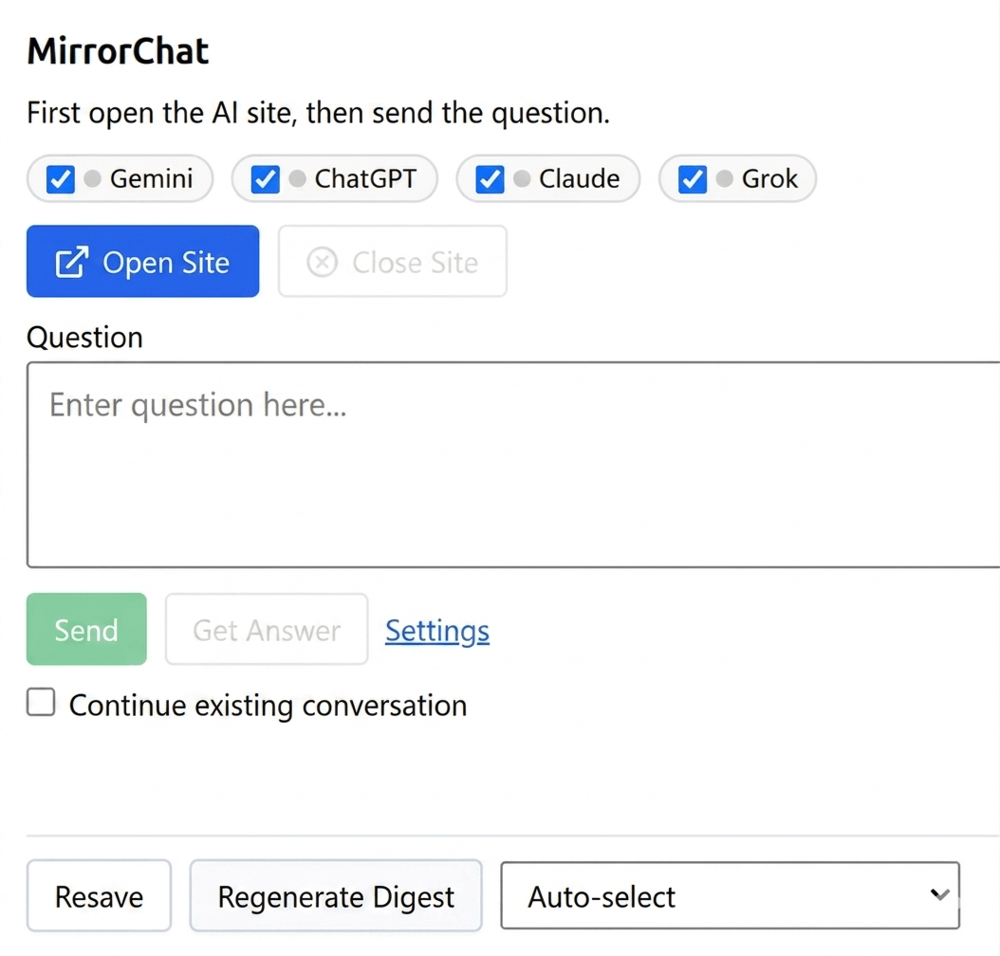

# MirrorChat

[English](README.md) | [日本語](README_ja.md)

MirrorChat is a Chrome extension that sends one prompt to four AI services in sequence and saves the results to Obsidian as Markdown.

It opens ChatGPT, Claude, Gemini, and Grok, submits the same question to each service, and stores every response in your Obsidian vault. It is built for people who want to compare model outputs and keep their research archive in Obsidian.




[](https://github.com/sponsors/nagisora)

## Features

- Send one question to ChatGPT, Claude, Gemini, and Grok in sequence
- Save responses to Obsidian through the Local REST API plugin
- Generate an asynchronous digest with a free OpenRouter model after the raw answers are saved
- Refresh OpenRouter free-model candidates from `/models`
- Use a two-step flow: open sites first, then send prompts after login is ready
- Adjust fragile DOM selectors from the Options page when provider UIs change

## Requirements

- Chrome
- Obsidian with the [Local REST API](https://github.com/coddingtonbear/obsidian-local-rest-api) plugin
- Logged-in accounts for ChatGPT, Claude, Gemini, and Grok

## Installation

1. Clone or download this repository.
2. Open `chrome://extensions/` in Chrome.
3. Enable Developer mode.
4. Click Load unpacked.
5. Select the `ai-prompt-broadcaster` folder.

## Usage

### 1. Prepare Obsidian

1. Install and enable the Local REST API plugin in Obsidian.
2. Check the plugin settings for the API token and port number. The default ports are 27123 for HTTP and 27124 for HTTPS.

### 2. Configure the extension

1. Right-click the extension icon and open Options.
2. Set Obsidian Local REST API Base URL, for example `http://127.0.0.1:27123/`.
3. Enter the API token from Obsidian if needed.
4. Set the storage root path, for example `200-AI Research`.
5. If you want digests, enable OpenRouter digest generation and add your API key.
6. If you want the latest free-model list, run Refresh free candidates.

### 3. Send a prompt

1. Click the extension icon.
2. Open the AI sites.
3. Log in to each service if needed.
4. Enter a question and click Send.
5. After the answers are collected, the extension saves a question file to Obsidian.
6. If digest generation is enabled, the extension updates the summary section asynchronously after the raw answers are stored.

### Output structure

```text
storage-root/
└── YYYYMMDD-sequence-question-prefix/
    ├── 01-question-prefix.md
    ├── 02-question-prefix.md
    └── 03-question-prefix.md
```

Each file contains the original question, a summary section, and all AI responses.

## Project structure

```text
mirror-chat/
├── ai-prompt-broadcaster/
│   ├── manifest.json
│   ├── popup.js, popup.html
│   ├── background.js
│   ├── content-*.js
│   └── ...
├── e2e/
├── docs/
└── README.md
```

## Documentation

- [Usage Guide](docs/CHROME_EXTENSION_USAGE.md)
- [Development Guide](docs/DEVELOPMENT.md)
- [Translation Workflow](docs/TRANSLATIONS.md)

## Development

- No build step. Load the source directly into Chrome.
- Run lint from the repository root with `pnpm lint`.
- Run end-to-end tests with `cd e2e && pnpm test`.

## Known limitations

- Provider DOM structures change frequently. If one provider stops working, update the selectors in Options.
- Saving fails when Obsidian is not running or the Local REST API plugin is disabled. Failed items can be retried later.
- OpenRouter free models are not always available. Digest generation may fail even when raw answer storage succeeds.

## License

[MIT License](LICENSE)

## Contributing

See [CONTRIBUTING.md](CONTRIBUTING.md).

## Sponsor

If MirrorChat is useful to you, consider supporting development on [GitHub Sponsors](https://github.com/sponsors/nagisora).
