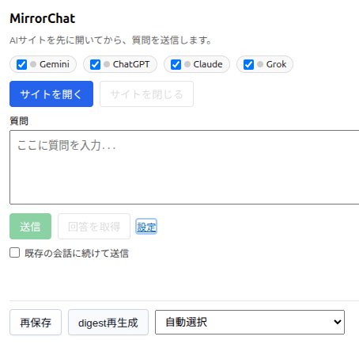

# MirrorChat

[English](README.md) | [日本語](README_ja.md)

1つのプロンプトを4つのAIサービスに順次送信し、ObsidianにMarkdownとして保存する Chrome 拡張機能です。

ChatGPT、Claude、Gemini、Grok の4つのAIチャットに同じ質問を一括送信し、回答を Obsidian の Vault に自動保存します。AI の回答を比較・検証したい方、Obsidian でナレッジ管理したい方に向いています。




[](https://github.com/sponsors/nagisora)

## 機能

- 1つの質問を ChatGPT / Claude / Gemini / Grok に順次送信
- Local REST API 経由で回答を Markdown として Obsidian に保存
- raw 回答保存後に OpenRouter の free モデルで digest を非同期生成
- OpenRouter の `/models` から free 候補を更新可能
- 「サイトを開く」→「送信」の2段階フローで、ログイン完了後に確実に送信
- Options 画面で各AIの DOM セレクタを調整可能

## 前提条件

- Chrome ブラウザ
- Obsidian と [Local REST API](https://github.com/coddingtonbear/obsidian-local-rest-api) プラグイン
- ChatGPT、Claude、Gemini、Grok へのログイン済みアカウント

## インストール

1. リポジトリをクローンまたはダウンロードします。
2. Chrome で `chrome://extensions/` を開きます。
3. デベロッパーモードを有効にします。
4. パッケージ化されていない拡張機能を読み込む をクリックします。
5. `ai-prompt-broadcaster` フォルダを選択します。

## 使い方

### 1. Obsidian の準備

1. Obsidian に Local REST API プラグインをインストールして有効化します。
2. プラグイン設定で API トークンとポート番号を確認します。既定は HTTP が 27123、HTTPS が 27124 です。

### 2. 拡張の設定

1. 拡張アイコンを右クリックして オプション を開きます。
2. Obsidian Local REST API ベース URL を設定します。例: `http://127.0.0.1:27123/`
3. 必要に応じて Obsidian の API トークンを入力します。
4. 保存ルートパスを設定します。例: `200-AI Research`
5. digest を使う場合は OpenRouter digest 生成を有効化し、API キーを設定します。
6. 最新の free 候補が必要な場合は free 候補を更新 を実行します。

### 3. プロンプト送信

1. 拡張アイコンをクリックします。
2. AI サイトを開きます。
3. 必要に応じて各サービスへログインします。
4. 質問を入力して 送信 をクリックします。
5. 回答取得後、質問ファイルが Obsidian に保存されます。
6. digest を有効化している場合は、raw 回答保存後に同じファイルの まとめ セクションへ非同期反映されます。

### 保存先構成

```text
保存ルートパス/
└── YYYYMMDD-連番-質問の先頭文字列/
    ├── 01-質問文抜粋.md
    ├── 02-質問文抜粋.md
    └── 03-質問文抜粋.md
```

各ファイルには質問本文、まとめセクション、全AI回答が含まれます。

## プロジェクト構成

```text
mirror-chat/
├── ai-prompt-broadcaster/
│   ├── manifest.json
│   ├── popup.js, popup.html
│   ├── background.js
│   ├── content-*.js
│   └── ...
├── e2e/
├── docs/
└── README.md
```

## ドキュメント

- [利用手順](docs/CHROME_EXTENSION_USAGE_ja.md)
- [開発ガイド](docs/DEVELOPMENT_ja.md)
- [翻訳運用ガイド](docs/TRANSLATIONS_ja.md)

## 開発

- ビルド工程はありません。ソースをそのまま Chrome に読み込みます。
- リポジトリルートで `pnpm lint` を実行できます。
- E2E テストは `cd e2e && pnpm test` です。

## 既知の制限

- 各AIサービスの DOM 構造は頻繁に変わります。動作しなくなった場合は Options 画面でセレクタを調整してください。
- Obsidian が起動していない、または Local REST API プラグインが無効な場合は保存に失敗します。失敗項目は後から再試行できます。
- OpenRouter の free モデルは可用性が不安定です。digest に失敗しても raw 回答保存は継続されます。

## ライセンス

[MIT License](LICENSE)

## コントリビューション

[CONTRIBUTING_ja.md](CONTRIBUTING_ja.md) を参照してください。

## スポンサー

MirrorChat が役に立ったら、[GitHub Sponsors](https://github.com/sponsors/nagisora) での支援をぜひお願いします。